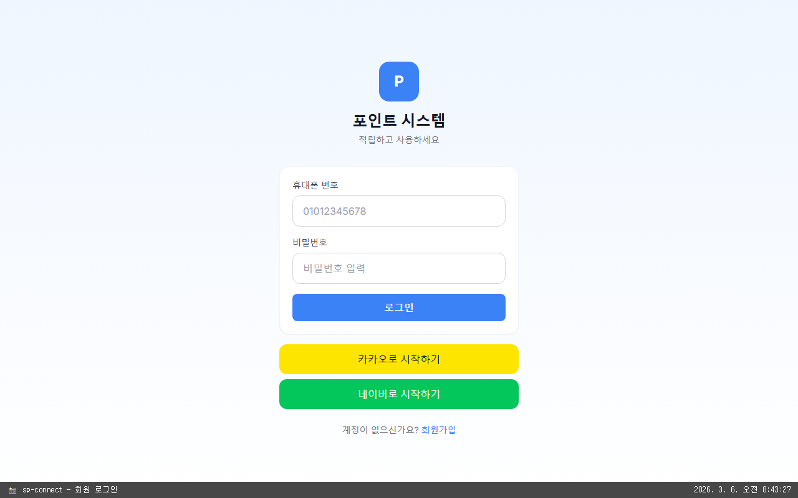
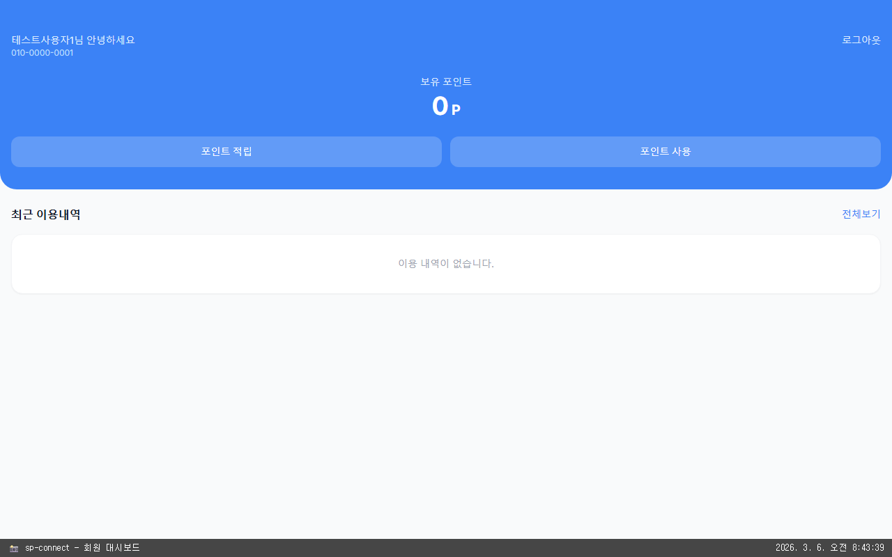
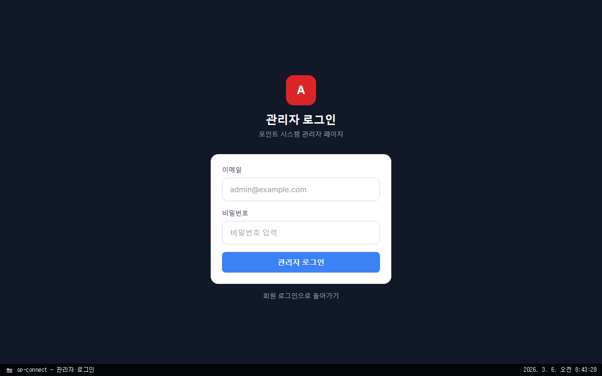
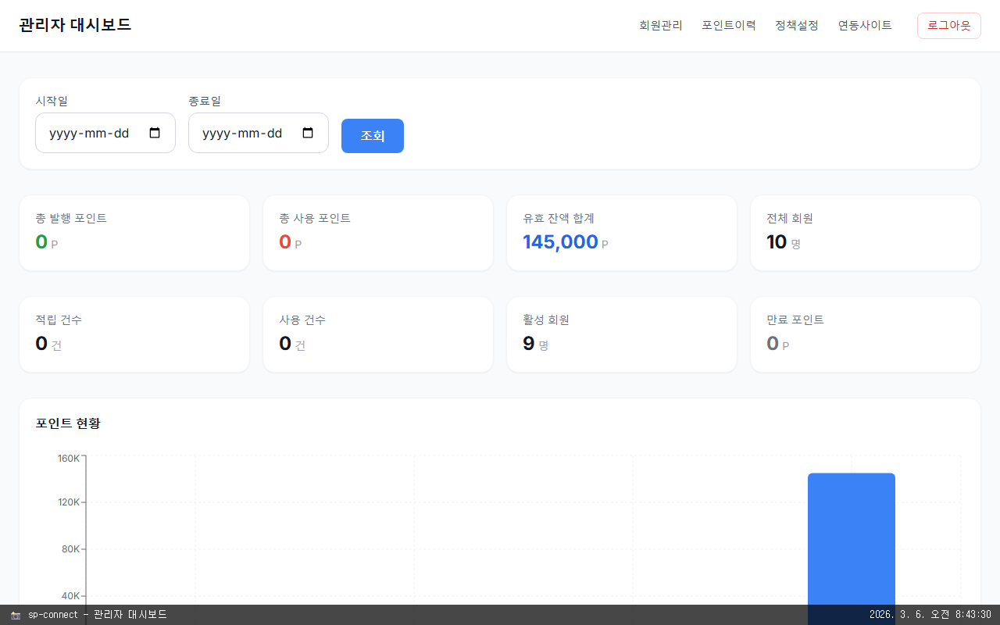
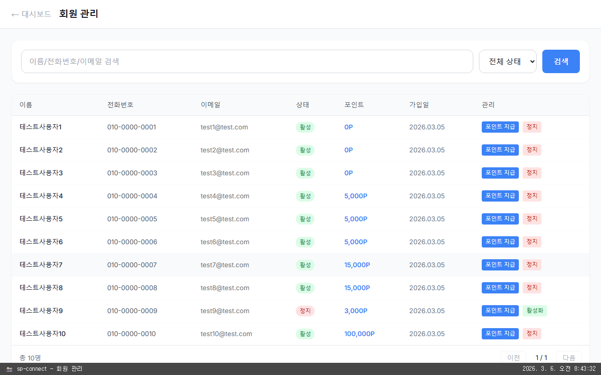
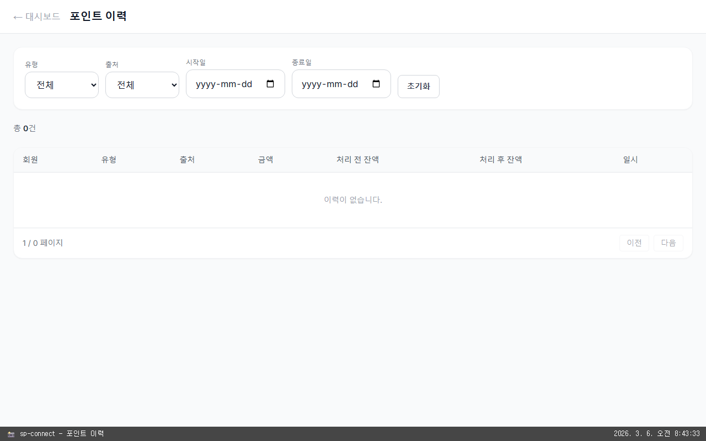
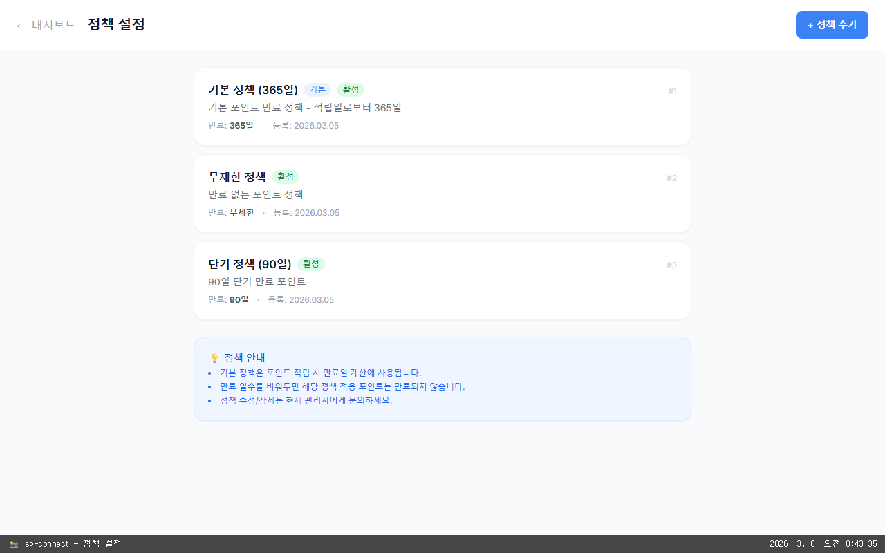
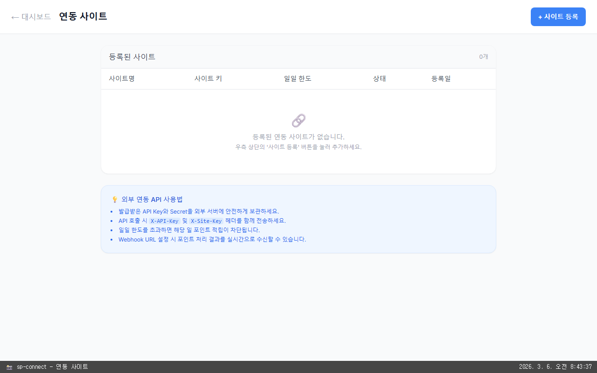

# 참고 자료

> [← README로 돌아가기](../README.md)

---

## 목차

1. [자주 쓰는 명령어](#자주-쓰는-명령어)
2. [프로젝트 구조](#프로젝트-구조)
3. [기술 스택](#기술-스택)
4. [페이지 스크린샷](#페이지-스크린샷)

---

## 자주 쓰는 명령어

```bash
# 전체 재시작
docker-compose restart

# 특정 서비스만 재시작
docker-compose restart backend

# 로그 실시간 확인
docker-compose logs -f backend
docker-compose logs -f frontend

# 종료 (데이터 유지)
docker-compose down

# 종료 + DB 데이터까지 삭제 (초기화)
docker-compose down -v

# 이미지 새로 빌드 (코드 변경 후)
docker-compose up -d --build backend

# DB 직접 접속
docker exec -it point_postgres psql -U postgres -d pointdb

# Redis 직접 접속
docker exec -it point_redis redis-cli -a redis_secret
```

---

## 프로젝트 구조

```
point-web/
├── backend/                  # NestJS 백엔드 API 서버
│   └── src/
│       ├── auth/             # 로그인, 소셜 로그인, 본인인증
│       ├── points/           # 포인트 적립/사용/만료 (핵심 로직)
│       ├── users/            # 회원 정보
│       ├── admin/            # 관리자 API
│       └── external/         # 외부 사이트 연동 API
│
├── frontend/                 # Next.js 프론트엔드
│   └── src/app/
│       ├── login/            # 로그인 페이지 (이메일+비밀번호, 소셜 로그인)
│       ├── register/         # 회원가입 (2단계: NICE 본인인증 → 이메일/PW 설정)
│       ├── auth/social/
│       │   └── callback/     # 소셜 로그인 콜백 (자동 로그인 or 계정 연동 분기)
│       ├── member/           # 회원용 화면 (로그인 필요)
│       │   ├── dashboard/    # 포인트 현황 + 소셜 계정 연동/해제
│       │   ├── earn/         # 포인트 적립 (준비 중 - UI stub)
│       │   ├── use/          # 포인트 사용 (준비 중 - UI stub)
│       │   └── history/      # 포인트 내역 (준비 중 - UI stub)
│       └── admin/            # 관리자 화면 (관리자 로그인 필요)
│           ├── login/        # 관리자 로그인
│           ├── dashboard/    # 대시보드 (통계, 차트)
│           ├── users/        # 회원관리 (상태변경, 포인트 수동지급)
│           ├── points/       # 포인트 이력 (유형/출처/기간 필터)
│           ├── policies/     # 정책 설정 (만료일수, 기본정책)
│           └── sites/        # 연동 사이트 (API 키 발급/관리)
│
├── database/
│   └── init.sql              # DB 테이블 생성 스크립트 (users, user_social_providers 등)
│
├── infra/nginx/nginx.conf    # 웹서버 설정
├── docs/API_SPEC.md          # 외부 연동 API 명세서
├── .github/workflows/
│   └── deploy.yml            # 자동 배포 설정
├── docker-compose.yml        # 로컬 전체 실행 설정
└── .env.example              # 환경 변수 예시
```

---

## 기술 스택

| 영역 | 기술 |
|------|------|
| 백엔드 | NestJS, TypeORM, PostgreSQL |
| 프론트엔드 | Next.js 14, Tailwind CSS, Zustand |
| 인증 | JWT, 이메일+비밀번호 로그인, 카카오/네이버 OAuth 연동, NICE 본인인증(가입 시 필수) |
| 인프라 | Docker, AWS ECS Fargate, RDS, ElastiCache |
| CI/CD | GitHub Actions |

---

## 페이지 스크린샷

> 📅 최초 캡쳐: 2026-03-06 08:43 KST
> 스크린샷 재생성: `node scripts/take-screenshots.js`

### 회원 페이지

#### 회원 로그인 (`/login`)


#### 회원 대시보드 (`/member/dashboard`)


---

### 관리자 페이지

#### 관리자 로그인 (`/admin/login`)


#### 관리자 대시보드 (`/admin/dashboard`)


#### 회원 관리 (`/admin/users`)


#### 포인트 이력 (`/admin/points`)


#### 정책 설정 (`/admin/policies`)


#### 연동 사이트 (`/admin/sites`)

